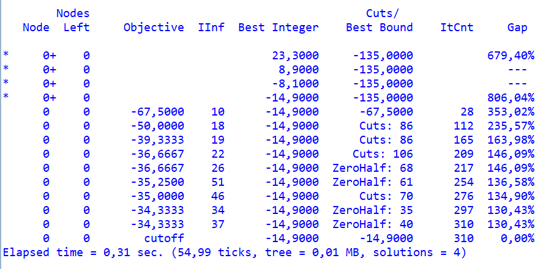

# Decentralisation Problem

A company plans to move some of its departments out of London to reduce costs and take advantage of benefits like cheaper housing, government incentives, and easier recruitment. However, this move also incurs higher communication costs between departments. The problem is descibed in "Model Building in Mathematical Programming" by H. Paul Williams.

## Goal
The goal is to determine the optimal locations for each department to minimize the overall yearly cost.

## Problem Description

The company has five departments: A, B, C, D, and E. They can be relocated to either Bristol or Brighton, or remain in London. No city, including London, can host more than three departments.

### Benefits of Relocation

The benefits (in thousands of pounds per year) of relocating each department are as follows:

| City     | A  | B  | C  | D  | E  |
|----------|----|----|----|----|----|
| Bristol  | 10 | 15 | 10 | 20 | 5  |
| Brighton | 10 | 20 | 15 | 15 | 15 |

### Communication Costs

Communication costs are calculated as C<sub>ik</sub>D<sub>jl</sub>, where C<sub>ik</sub> is the quantity of communication between departments i and k per year, and D<sub>jl</sub> is the cost per unit of communication between cities j and l.

#### Quantities of Communication (C<sub>ik</sub>) in thousands of units:

|   | A   | B   | C   | D   | E   |
|---|-----|-----|-----|-----|-----|
| A | -   | 0.0 | 1.0 | 1.5 | 0.0 |
| B | -   | -   | 1.4 | 1.2 | 0.0 |
| C | -   | -   | -   | 0.0 | 2.0 |
| D | -   | -   | -   | -   | 0.7 |

#### Costs per Unit of Communication (D<sub>jl</sub>) in £:

|          | Bristol | Brighton | London |
|----------|---------|----------|--------|
| Bristol  | 5       | 14       | 13     |
| Brighton | -       | 5        | 9      |
| London   | -       | -        | 10     |

## Mathematical Formulation

### Variables

#### Location Variables ($\delta_{ij}$)

$$
\delta_{ij} = \begin{cases} 
1 & \text{if department } i \text{ is located in city } j \\
0 & \text{otherwise} 
\end{cases}
$$


#### Communication Variables ($\gamma_{ijkl}$)

$$
\gamma_{ijkl} = \begin{cases} 
1 & \text{if } \delta_{ij} = 1 \text{ and } \delta_{kl} = 1 \\
0 & \text{otherwise} 
\end{cases}
$$

### Constraints

1. **Each department must be located in exactly one city:**

$$
\sum_{j} \delta_{ij} = 1 \quad \text{for all } i
$$

2. **No city may be the location for more than three departments:**

$$
\sum_{i} \delta_{ij} \leq 3 \quad \text{for all } j
$$


3. **Relating ($\gamma_{ijkl}$) to ($\delta_{ij}$):**

Using the variables $\delta_{ij}$ together with the two types of constraint above, we could formulate a model with an objective function involving some quadratic terms $\delta_{ij} \delta_{kl}$. Instead, these terms are replaced by the 0–1 variables $\gamma_{ijkl}$ giving a linear objective function. It is, however, necessary to relate these new variables to the $\delta_{ij}$ variables correctly. To do this, we model the relations:

$$
\gamma_{ijkl} = 1 \rightarrow \delta_{ij} = 1, \delta_{kl} = 1
$$

and

$$
\delta_{ij} = 1, \delta_{kl} = 1 \rightarrow \gamma_{ijkl} = 1
$$

The first conditions can be achieved by the following constraints:

$$
\gamma_{ijkl} - \delta_{ij} \leq 0 \quad \text{for all } i, j, k, l
$$

and

$$
\gamma_{ijkl} - \delta_{kl} \leq 0 \quad \text{for all } i, j, k, l
$$


The second conditions are achieved by the constraints:

$$
\delta_{ij} + \delta_{kl} - \gamma_{ijkl} \leq 1 \quad \text{for all } i, j, k, l
$$

### Objective Function

Minimize the total cost:

$$
-\sum_{i,j} B_{ij} \delta_{ij} + \sum_{i,j,k,l} C_{ik} D_{jl} \gamma_{ijkl}
$$


## Program launch

1. **Install Python**: Ensure that Python is installed. Download it from [python.org](https://www.python.org/downloads/).
2. **Install DOcplex**: Install the DOcplex library with pip:
    ```bash
    pip install docplex
    ```
3. Launch the program and see the results:
   ```bash
   python decentralization.py
   ```


## Model


## Solution


New department locations:
- Bristol: Departments A and D
- Brighton: Departments B, C, and E

Total Yearly Benefit: £80,000 <br>
Communication Costs: £65,100

If all departments had remained in London, communication costs would have been £78,000.

The relocation of departments results in a net yearly benefit of £14,900.


## Solution details


Model found multiple solutions with the Best Integer values improving progressively.
- First Solution: Best Integer = £23,300
- Second Solution: Best Integer = £8,900
- Third Solution: Best Integer = -£8,100
- Fourth Solution: Best Integer = -£14,900


Progressed from -£67,500 to -£34,333 with multiple cut applications.

Best Integer Value stabilized at -£14,900 early in the process, indicating the solution's proximity to optimality.
